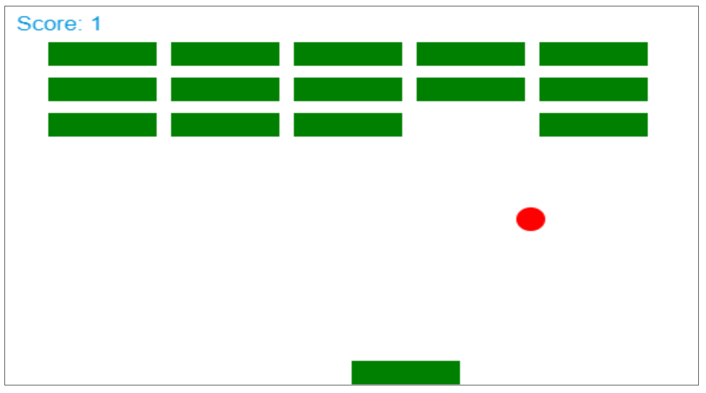

# Brick-Breaker-Game

### Task:

Making a fully functional and completed brick-breaker game.

### Purpose:

Improving my software development, design, and game development skills while building a fun game in the process.

### Languages:

HTML, CSS, JavaScript

### Hosting:

Github Pages

### How To Play:

Move your Left and Right Arrow Keys to catch the ball before it drops and break all the bricks to reach the next level. There are 10 levels in total. If you manage to beat the tenth level then you have completed the game!

### Live Demo:

https://mtemkit.github.io/Brick-Breaker-Game/ 

Early stages of development:

  

### Next Steps / Future Changes:

- Removing the level options and automatically increasing the difficulty after completion of a level (such as "level completed!" with "congratulations you win!" at the end).

- Break where you can press continue upon completing a level.

- Fix the pause and resume functionality.

- Better color and design for the paddle, ball, and block.

- Changing the block organization for each of the ten levels.

- Full canvas for the game.

- 3-second timer at each level.

- Better detection of the paddle and ball so it looks more natural.

- Smoother transition speed of the paddle.

- Being able to shoot down the blocks as well, on top of hitting them with a ball.

- Intro game screen where you press enter to start.

- Confetti when the game is completed.

- Game music loopable mp3 that can be turned off (from the home screen, and maybe afterwards).

- Full screen option for the game.